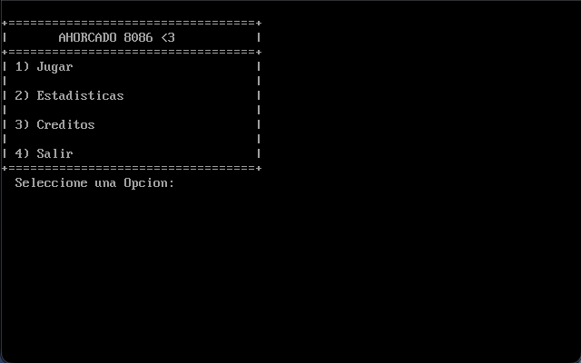
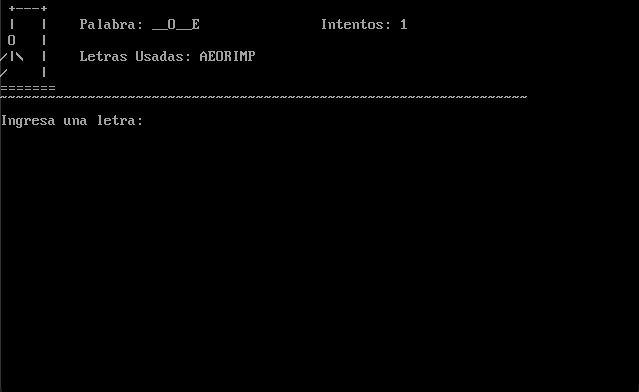
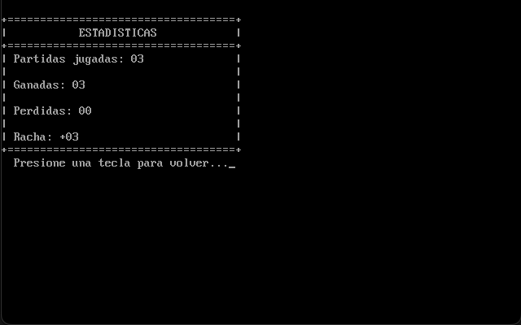

# Ahorcado 8086

Juego del Ahorcado desarrollado en Assembler 8086 para la materia **Sistema de Procesamiento de Datos (SPD)** de la UNSAM. Corre sobre DOSBox usando TASM/TLINK como compilador y linker.

---

## Capturas

### Menú principal


Pantalla de inicio con las 4 opciones disponibles. La selección se hace con las teclas 1-4 — los caracteres inválidos no se muestran en pantalla (lectura sin eco via `INT 21h AH=08h`).

### Juego en curso


Vista del juego con el gráfico ASCII del ahorcado, la palabra oculta, los intentos restantes y las letras ya usadas. El gráfico se actualiza en tiempo real con cada error. Al ganar, se emite un beep via interrupción `INT 60h` (TSR personalizado `BEEP60`).

### Estadísticas


Pantalla de estadísticas con partidas jugadas, ganadas, perdidas y racha actual. La racha solo se muestra si es mayor a 0 — se resetea al perder.

---

## Requisitos

- [DOSBox](https://www.dosbox.com/) 0.74 o superior
- TASM / TLINK (incluidos en el entorno de la cátedra)
- TSR `BEEP60` para el sonido (se compila desde `BEEP60.asm`)

---

## Compilar y ejecutar

Dentro de DOSBox, montar la carpeta del proyecto y ejecutar:

```
compilar.bat
```

El script compila `BEEP60.asm` (TSR de sonido), lo instala en memoria, compila y linkea el juego, y lo ejecuta automáticamente.

---

## Funcionalidades

- Selección aleatoria de palabra via `INT 1Ah` (reloj BIOS)
- 31 palabras temáticas del ámbito de sistemas y arquitectura
- Gráfico ASCII del ahorcado con 7 estados (6 intentos)
- Letras usadas: no descuenta intentos si repetís una letra
- Arte ASCII al ganar (GANASTE) y al perder (PERDISTE)
- Menú con navegación por teclado
- Estadísticas de sesión: partidas, ganadas, perdidas y racha
- Sonido al ganar via interrupción `INT 60h`
- Pantalla de créditos

---

## Créditos

Desarrollado por:
- Ezequiel Di Giacomo Insua
- Lemmy Nehuen Wolter
